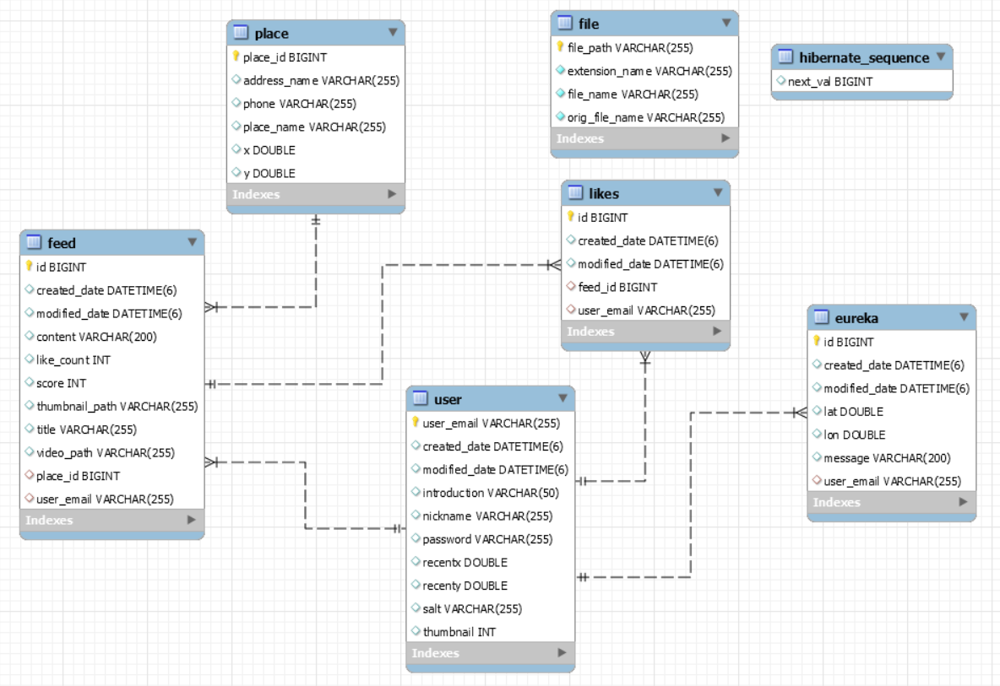

# 준현이 한 일

## 1. 서버 관리

### Ubuntu (aws ec2)

1. 아마존 웹 서비스의 ec2 서비스의 Ubuntu를 제공받고 putty와 Filezilla를 활용하여 Ubuntu 관리

2. nginx, mysql, tomcat 설치


### Backend 배포 방법

1. 스프링 부트 프로젝트를 jar 형식의 파일로 추출
2. Filezilla를 통해 Ubuntu 서버로 jar 파일 이동
3.  아래와 같은 방법으로 jar 파일 실행

#### 1. jar 돌리는 법

```
java -jar yumyum.jar
```

#### 2. jar  백그라운드로 돌리는 법

```
nohup java -jar yumyum.jar &
```

#### 3. 프로세스 id 찾는법

```프로세스 id 찾는 법
ps -ef | grep yumyum.jar
```

#### 4. 프로세스 죽이는 법

``` 프로세스 죽이는 법
kill -9 170473
```


### Frontend 배포 방법

1. VS Code를 열고 yarn build를 실행
2. 빌드가 완료 되면 build 폴더를 Filezilla를 통해 Ubuntu의 nginx 기본 폴더 (/var/www/html/dist)에 build 폴더의 내부 파일 이동


### HTTPS/SSL 적용

#### 프론트 https 적용

1. let`s encrypt의 Certbot을 활용하여 인증서를 발급

2. nginx.conf 설정

   ```
   worker_processes  1;
   
   events {
       worker_connections  1024;
   }
   
   http {
       include       mime.types;
       default_type  application/octet-stream;
       sendfile        on;
       keepalive_timeout  65;
   
       server {
           listen       80 default_server;
           listen [::]:80 default_server;
           server_name i4b101.p.ssafy.io;
           client_max_body_size 30M;
           keepalive_timeout 5;
           return 301 https://$server_name$request_uri;
   
           index index.html index.htm;
       }
       
       # HTTPS server
       server {
           listen       443 ssl;
           listen [::]:443 ssl;
   
           server_name  i4b101.p.ssafy.io;
   
           ssl_certificate      /etc/letsencrypt/live/i4b101.p.ssafy.io/fullchain.pem;
           ssl_certificate_key  /etc/letsencrypt/live/i4b101.p.ssafy.io/privkey.pem;
   
           ssl_session_cache    shared:SSL:1m;
           ssl_session_timeout  5m;
   
           root /var/www/html/dist;
           index index.html index.htm;
   
           location / {
                   try_files $uri $uri/ /index.html;
           }
   
           location /yumyum {
                   proxy_set_header  X-Real-IP $remote_addr;
                   proxy_set_header  X-Forwarded-For $proxy_add_x_forwarded_for;
                   proxy_set_header  X-Forwarded-Proto $scheme;
                   proxy_set_header  X-NginX-Proxy true;
   
                   proxy_pass https://localhost:9090;
                   proxy_redirect off;
                   charset utf-8;
           }
       }
   ```

   

#### 백엔드 적용

1. let`s encrypt에서 발급받은 인증서를 윈도우로 가져온다.
2. pem 형식의 인증서를 pkcs12 파일 형식으로 변환하여 백엔드 프로젝트 폴더에 넣는다.
3. application.properties에 다음과 같은 코드를 추가한다.

```
# ssl 설정 (https)
server.ssl.key-store=classpath:keystore.p12
server.ssl.key-store-type=PKCS12
server.ssl.key-store-password=wnsgus123
server.ssl.key-alias=tomcat
server.port=9090
```

## 2. DB 설계

> 앱에 사용되는 전체적인 DB를 이수민 팀원과 같이 설계



## 3. Feed (Backend)

### 1. 피드 생성

동영상 업로드

### 2. 피드 수정

### 3. 피드 조회

1. 단일 피드 조회
2. 모든 피드 조회
3. 한 유저의 모든 피드 조회
4. 한 유저의 피드 타이틀 리스트 조회
5. 한 유저의 하나의 타이틀로 적힌 피드 리스트 조회

### 4. 피드 삭제

### 5. 피드 좋아요


## 4. Place (Backend)

### 1. place 저장

### 2. place_id로 해당 place로 등록된 피드 리스트 조회

### 3. 모든 place를 리스트로 조회


## 6. JWT

### 1. JwtServiceImpl

> Jwt를 사용하기 위해서 필요한 메서드를 정의

- create : Jwt를 생성하는 메서드
- isUsable : 전달 받은 토큰이 제대로 생성된것인지 확인 하고 문제가 있다면 UnauthorizedException을 발생.
- get : Jwt의 body를 가져오는 메서드

### 2.  WebConfig

> JwtInterceptor를 설정하고 전역의 Cors 처리를 한다.

```java
public class WebConfig implements WebMvcConfigurer {
    private static final String[] EXCLUDE_PATHS = { "/account/**", "/error/**" };

    @Autowired
    private JwtInterceptor jwtInterceptor;

    @Override
    public void addInterceptors(InterceptorRegistry registry) {
		registry.addInterceptor(jwtInterceptor).addPathPatterns("/feed/**", "/map/**", "/eureka/**") // 기본 적용 경로
        .excludePathPatterns(EXCLUDE_PATHS);// 적용 제외 경로
    }

    @Override
    public void addCorsMappings(CorsRegistry registry) {	registry.addMapping("/**").allowedOrigins("*").allowedMethods("*").allowedHeaders("*")
				.exposedHeaders("Authorization");
    }
}
```

### 3. JwtInterceptor

> Api 서버로 요청이 오면 WebConfig에 Interceptor에서 설정한 특정 url로 들어오는 요청은 jwt 토큰 인증을 수행하게 된다.

prehandle 메서드 내에서 header의 Authorization 값의 jwt 토큰을 추출하고 토큰이 없거나 토큰이 유효하지 않으면 UnauthorizseException을 throw하고 유효하다면 요청한 Controller로 넘어간다.

### 4. UnauthorizedException

> message에 "jwt unauthorized"를 반환한다.