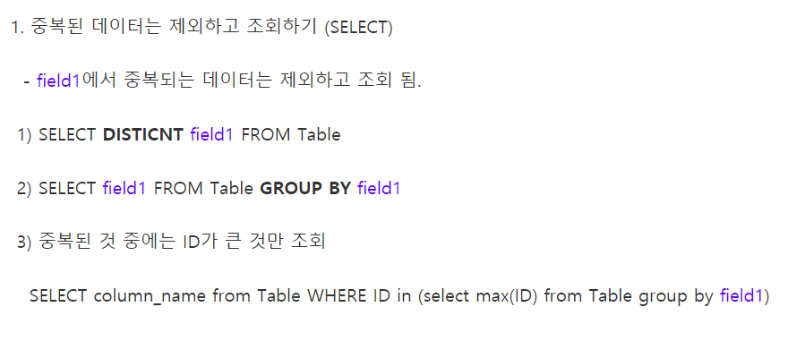
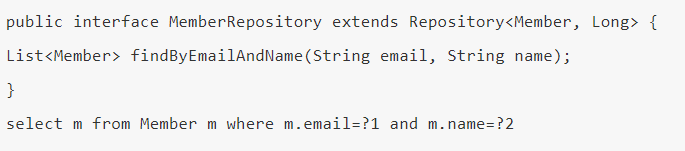
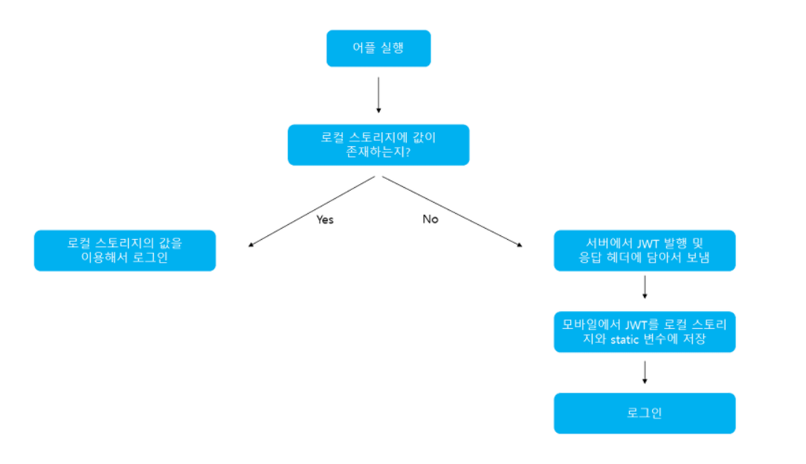
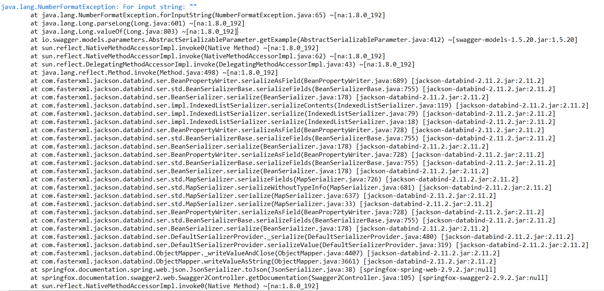

# 역할

- 백엔드 PL(Proejct Leader)
  - 백엔드 파트를 리드하고 프론트엔드와의 협업을 위한 소통을 담당
  - 백엔드 파트의 업무 조율
- 백엔드 개발자
  - 백엔드 파트 구현
  - DB 스키마 설계

#### Native Query 

- JPA는 SQL을 직접 사용할 수 있는 기능을 제공하는 것을 네이티브 쿼리라고 함
- @Query(value="쿼리문",Native Query=ture)




**현재 이메일에서 title,file_path만 조회하는데 title의 중복된 것 중에서 ID가 큰 것만 조회**

// select title,file_path from Feed where user_email="sum@s.com" and id in (select max(id) from Feed group by title);

```
@Query(value="SELECT title,video_path from Feed where user_email=?1 and id in (select max(id) from Feed group by title) order by title" ,nativeQuery=true)
   List<ArrayList<String>> findByUser_email(String email);
```

?1은 1은 파라미터의 어느 부분을 받아올지 쓰는 부분이다.

  


JPA에서 기본적으로 제공해주는 API

#### JWT란 ?

토큰 기반의 인증시스템에서 주로 사용하는 JWT 

JWT(Json Web Token)란 **Json 포맷을 이용하여 사용자에 대한 속성을 저장하는 Claim 기반의 Web Token**이다. 주로 회원 인증이나 정보 전달에 사용되는 JWT는 아래의 로직을 따라서 처리된다.



애플리케이션이 실행될 때, JWT를 static 변수와 **localStorage** 에 저장하게 된다.

static 변수에 저장되는 이유는 HTTP 통신을 할 때마다 JWT를 HTTP 헤더에 담아서 보내야 하는데, 이를 **localStorage** 에 계속 불러오면 오버헤드가 발생하기 때문이다. 클라이언트에서 JWT를 포함해 요청을 보내면 서버는 허가된 JWT인지를 검사한다. 또한 로그아웃을 할 경우 **localStorage** 에 저장된 JWT 데이터를 제거한다.


jwt에 넣어놓은 데이터 가져오기

```
String jwt = request.getHeader("Authorization");
claims = Jwts.parser().setSigningKey(TK.getBytes("UTF-8")).parseClaimsJws(jwt);
```


email을 다시 얻어옴

```
public String getUserEmail() {
    return (String)this.get("email").get("email");
}
```


토큰 생성 (유효1시간)

```
  String jwt = Jwts.builder().setHeaderParam("typ", "JWT").setHeaderParam("regDate", System.currentTimeMillis())
                .setExpiration(new Date(System.currentTimeMillis() + 1000 * 60 *60))
                .setSubject(subject).claim(key, data).signWith(SignatureAlgorithm.HS256, this.generateKey()).compact();
```

HTTP 헤더에서 JWT를 가져온 후 유효한지 검사

```
Jws<Claims> claims = Jwts.parser().setSigningKey(this.generateKey()).parseClaimsJws(jwt);
```


jwt.io에서 토큰값을 다시 변경된 데이터값으로 확인가능함!!


#### DataBase Schema 자동 생성 기능 제공

JPA는 이 매핑정보와 데이터베이스 방언을 사용해서 데이터베이스 스키마를 생성한다.

```
spring.jpa.hibernate.ddl-auto=create
```

application.properties에 이 코드를 추가하면 애플리케이션 실행 시점에 데이터베이스 테이블을 자동적으로 생성한다.

- create :  기존 테이블 삭제, 새로 생성 (DROP + CREATE)
- create-drop : create 속성에 추가로 애플리케이션을 종료할 때 생성한 DDL을 제거
- update : DB 테이블과 엔티티 매핑정보를 배교해서 변경 사항만 수정함 (DROP + CREATE + DROP)
- validate : DB 테이블과 엔티티 매핑정보를 비교해서 차이가 있으면 오류를 남기며 애플리케이션을 실행하지 않는다. DDL을 수정 X

#### JPA 연관 매핑

```
@Column(length = 200)
private String content;
@Column(length = 50)
	private String introduction;
```

- DTO에@Column(length = x )를 추가하면 x자를 초과하면 안된다는 제약조건임
- nullable=false  - > false로 지정하면 자동 생성되는 DDL에 not null 제약조건 추가 됨

```
@Id
@Column(name="USER_EMAIL")
private String email;
```

- primary key 를 할당하려면 @Id 를 사용하면 됨

```
@GeneratedValue(strategy = GenerationType.AUTO)
private Long id;
```

- ID 컬럼에 자동적으로 값이 입력된다.
- GeneratedValue.strategy의 기본값은 Auto이다 . 
- @GeneratedValue만 사용해도 됨


@Entity

- JPA를 사용해서 테이블과 매핑할 클래스에 사용

  

```
@ManyToOne
@JoinColumn(name = "USER_EMAIL")
private User user;

@ManyToOne
@JoinColumn(name = "PLACE_ID")
private Place place;
```

- @JoinColumn은 외래 키를 매핑할 때 사용
- name은 매핑할 외래 키 이름 
- @ManyToOne은 다대일 관계에서 사용
-   Feed는 User 엔티티나 Place 엔티티를  참조할 수 있지만 User나 Place는 Feed를 참조하는 필드가 없다.  


#### Swagger pathvariable 오류 

java.lang.NumberFormatException: For input string: ""




	@GetMapping("/{id}")
	@ApiOperation(value = "단일 피드 조회")
	public Object search(@Valid @ApiParam(value = "id 값으로 검색", required = true) @PathVariable String id)     {
	Optional<Feed> curFeed = feedDao.findById(Long.parseLong(id));
	if (!curFeed.isPresent()) {
	return makeResponse("404", null, "No searchResult", HttpStatus.NOT_FOUND);
	}
	
	return makeResponse("200", convertObjToJson(curFeed.get()), "success", HttpStatus.OK);
	}


#### 비밀번호 암호화

- sha256 단 방향 방식으로 암호화된 값 
- sha256은 단방향이기 때문에 복호화는 되지 않는다.
- 양방향의 경우엔 AES-256라는 게 있는데 이름, 주소, 연락처 등 복호화가 필요한 정보의 경우 이렇게 저장 

- SHA 는 Secure Hash Algorithm의 약어로 해시함수를 사용하는 암호화 알고리즘이다.
- 사용자 입장에서 DB관리자와 공격자를 신뢰할 수 없음


1. **회원가입을 할 때 비밀번호를 받아 암호화 함**
   - 암호화 할 때 짝을 이루는 난수를 발생시켜 암호화에 이용. 이 난수를 Salt라 함
   - DB에 암호화된 비밀번호화 Salt 값을 저장
2. **로그인할 때 ID에 맞는 Salt 가져옴**
3. **입력한 Password와 Salt를 통해 암호화 시킨 값을 비밀번호로 set 해준 뒤 쿼리를 통해 일치하는 값이 있는지 비교**

> 
>
> **DB에 SALT를 추가함**
>
> * Salt 값은 복호화에 있어 중요한 단서이기 때문에 이 또한 그대로 저장하지 않음. 실무에서는 다른 서버에 SALT값만을 가지는 DB를 두거나 SALT를 양방향 암호화 함
>
> * 비밀번호가 암호화 돼 길어지기 때문에 사이즈는 넉넉 !
>
> 
>
> **Salt 사용 이유**
>
> (원인)
>
> - 동일한 메시지는 동일한 다이제스트를 가짐
>   - 해커들이 다이제스트들을 모아 놓아 사용(레인보우 테이블)
> - 무차별한 대입 공격(브루트포스)
>   - 빠르게 데이터 검색을 할 수 있게 설계된 해시함수를 해커들도 똑같이 빠르게 값을 얻음
>
> (방법)
>
> - 솔트란 해시함수를 돌리기 전에 원분에 임의의 문자열을 덧붙이는 것을 말한다.
> - 솔트의 가장 큰 목적은 해당 솔트의 레인보우 테이블 새로 생성하여 만들기 위해서는 엄청나게 큰 데이터를 필요로 하기 때문에 자연스럽게 레인보우 테이블 생성을 방지해주는 역할!

암호화 방식 지정 

```
MessageDigest md = MessageDigest.getInstance("SHA-256");
md.update(bytes);

byte[] byteData = md.digest();

StringBuffer sb = new StringBuffer();
for (int i = 0; i < byteData.length; i++) {
    sb.append(Integer.toString((byteData[i] & 0xFF) + 256,
            16).substring(1));
```

Salt

```
Random random = new Random();

    byte[] salt = new byte[8];
    random.nextBytes(salt);

    StringBuffer sb = new StringBuffer();
    for (int i = 0; i < salt.length; i++) {

        //byte 값을 Hex 값으로 바꾸기.
        sb.append(String.format("%02x", salt[i]));
    }
    return sb.toString();
}
```


Account controller에 로그인, 회원가입, 패스워드변경 등 비밀번호에 관련된 메소드에 추가

```
String salt = SHA256Util.generateSalt();
String password = SHA256Util.getEncrypt(request.getPassword().trim(), salt);
```


