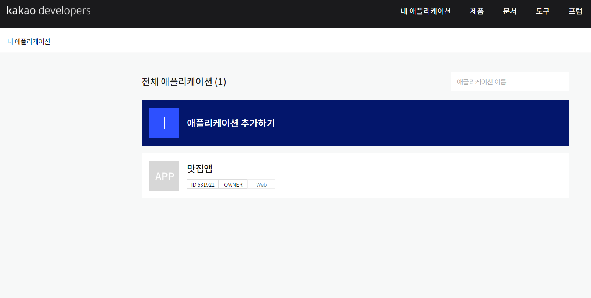
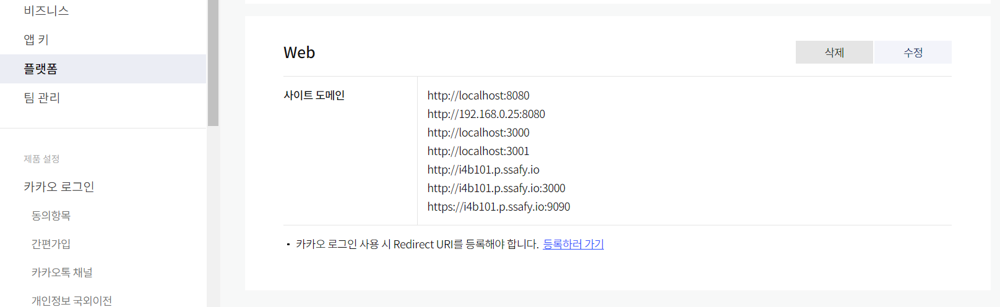

# 맡은부분

- 프론트 개발자

  - 프론트엔드 파트 구현

  - 외부 API(카카오지도)
  - UI/UX 고안 후 구현

## 지도

>  네이버 , 구글, 카카오 지도 중에서 카카오 지도  api가 월 300만건 요청까지 무료로 보낼 수 있어서 카카오 지도 api를 활용하기로 결정

### 카카오 API 빌드 과정

> 카카오 지도 API URL : https://apis.map.kakao.com/

#### 앱  key 발급



#### 플랫폼에 url등록



#### index.html에 앱키 등록

```html
<script type="text/javascript"
        src="//dapi.kakao.com/v2/maps/sdk.js?appkey="앱키",clusterer,drawing"></script>
```


### ❗ 개발과정과 어려웠던점


### 지도 검색 페이지

> 카카오 지도 api를 활용해서 음식점을 검색하는 페이지 

#### 1. 지도 띄우기

- 카카오 지도 API의 docs나 sample코드들은 전부 javascript로 제작되어 있어 React를 기반으로 다시 코드를 수정해서 적용해야 했는데 React의

hook사용이 미숙해서 지도를 화면에 띄우는 게 어려웠다. 

- `useEffect` 를 사용해서 페이지가 렌더된 후 `<div id="map" style={{ width: "100vw", height: "83.5vh" }}></div>` 의 map id를 잡아

  map 이 그려지도록 코드를 짜서 구현할 수 있었음. 


#### 2. 장소검색

- 현재위치를 기반으로 가까운 음식점을 먼저 리스트로 출력하고 싶어서 처음에는 경도,위도를 서버로 보내서 처리해야하는 줄 알았는데 카카오  API에서 자체적으로 거리 기반 검색기능이 있어서 그걸 활용.

```javascript
function searchPlaces() {
    if (searchContent) {
    // 장소검색 객체를 통해 키워드로 장소검색을 요청합니다.
    ps.keywordSearch(searchContent, placesSearchCB, {
      location: center,
      sort: kakao.maps.services.SortBy.DISTANCE, // 가까운 거리의 검색결과를 우선순위로 반환
    });
    setIsList(true);
    }
  }
```


#### 3 .현재위치

- https부터 현재위치를 받아 오는 **navigator.geolocation** 이용했는데  `useEffect`를 사용해서 처음 위치 마커를 map상에 띄워주려고 했는데 `map undefined` 오류로 마커가 띄워지지 않았음.
- map이 랜더되기 전에 마커가 생성되어 맵이 생성되고 나서 현재위치 생성 함수를 넣어 해결

```javascript
const createMap = () => {
    let container = document.getElementById("map");
    let options = {
      center: new kakao.maps.LatLng(37.506502, 127.053617),
      level: 7,
      draggable : true,
    };
    let map = new kakao.maps.Map(container, options);
    setPs(new kakao.maps.services.Places());
    setInfowindow(new kakao.maps.InfoWindow({ zIndex: 1 }));
    setCreateMap(map);
    nowLocation(map); // 현재위치 생성 함수
  };
```


#### 4 .검색마커 이미지 변경

- 기본 마커 이미지에서 마커 이미지를 변경하고 지도를 축소 또는 확대했을떄 원래 찍혀야하는 마커에서 벗어나는 경우가 발생

- 마커 좌표에 일치시킬 이미지 내에서의 좌표를 마커 이미지 크기와 동일하게 설정해서 해결

```javascript
var imageSrc =
        "https://t1.daumcdn.net/localimg/localimages/07/mapapidoc/marker_number_blue.png", // 마커 이미지 url, 스프라이트 이미지를 씁니다.
      imageSize = new kakao.maps.Size(36, 37), // 마커 이미지의 크기
      imgOptions = {
        spriteSize: new kakao.maps.Size(36, 691), // 스프라이트 이미지의 크기
        spriteOrigin: new kakao.maps.Point(0, idx * 46 + 10), // 스프라이트 이미지 중 사용할 영역의 좌상단 좌표
        offset: new kakao.maps.Point(13, 37), // 마커 좌표에 일치시킬 이미지 내에서의 좌표
      },
      markerImage = new kakao.maps.MarkerImage(imageSrc, imageSize, imgOptions);
```


#### 5 .검색된 정보 기반 리스트 보여주기

- 검색과 동시에 map에 마커를 적용하고 리스트를 하단에 출력시켜 리스트와 지도의 마커중 어떤 것을 클릭해도 장소 정보를 저장할 수 있게 구성해야해 했음.
- 리스트 목록을 출력하기 위해서 하나의 컴포넌트를 만들어서 출력하는 방식이 어려워서 시간 소비를 많이했다.
- fragment로 가상 document를 만들고 거기에  listitem들을 담아서 `placesList`에 `appendChild` 를 이용해서 리스트 목록을 출력할 수 있었음. 

```javascript
function displayPlaces(places) { 

    let bounds = new kakao.maps.LatLngBounds(),
      listEl = document.getElementById("placesList"),
      menuEl = document.getElementById("menu_wrap"),
      fragment = document.createDocumentFragment(), // 가짜 document를 만들고 거기에 담아서 한번에 appendchild하면 메모리를 줄일수 있다.
      listStr = "";
    // 지도에 표시되는 마커를 제거한다.
    removeAllChildNods(listEl);

    removeMarker();
    // 검색했을때 현재위치를 제거하는 함수 마커가 있으면 제거해준다.
    if (nowMarker) {
      removeNowMarker();
    }

    for (let i = 0; i < places.length; i++) {
      let placePosition = new kakao.maps.LatLng(places[i].y, places[i].x),
        marker = addMarker(places[i], i),
        itemEl = getListItem(i, places[i]);

      bounds.extend(placePosition);

      (function (marker, title) {
        kakao.maps.event.addListener(marker, "mouseover", function () {
          displayInfowindow(marker, title);
        });

        kakao.maps.event.addListener(marker, "mouseout", function () {
          infowindow.close();
        });

        itemEl.onclick = function () {
          setDetailPlaceInfo(places[i]);
          displayInfowindow(marker, title);
          map.setLevel(3);
          map.panTo(placePosition);
          setIsList(false);
        };

        itemEl.onmouseout = function () {
          infowindow.close();
        };
      })(marker, places[i].place_name);

      fragment.appendChild(itemEl);
    }
    //  검색 결과 항복을 결과목록의 Elemnet에 추가 한다.
    listEl.appendChild(fragment);
    menuEl.scrollTop = 0;
    // 검색된 장소 위치를 기준으로 지도 범위 재설정
    map.setBounds(bounds);
  }
```

- Map HTML

```html
  <div className="feedmap">
      { isList ? <></> :  detailPlaceInfo ? 
        <ArrowForwardRoundedIcon className="arrowcircle" onClick={sendPlaceInfo} fontSize="large" /> : 
        <div className="skip" onClick={sendPlaceInfo}> 집에서 먹었어요! </div>
      }
      <div className="map_wrap">
        <div id="map" style={{ width: "100vw", height: "83.5vh" }}></div>
        {isList && (
          <div id="menu_wrap" className="bg_white">
            <div className="option"></div>
            <ul id="placesList"></ul>
            <div id="pagination"></div>
          </div>
        )}
      </div>
    </div>
```

#### 6. 마커 지우기

- 처음에는 marker라는 변수를 null로 만들어주고 이걸 map에 대입시켜서 지도상의 마커를 지울 수 있을 줄 알았다. 하지만 marker라는 객체 또한 카카오 api의 클래스로 만들어진 객체이기 때문에 지우는 함수가 따로 존재했고 다음과 같이 marker객체를 배열로 저장해 처리할 수 있었다.

```javascript
 // map에 있는 marker를 지우는 함수
  function removeMarker() {
    for (var i = 0; i < markers.length; i++) {
      markers[i].setMap(null);
    }
  }
```

#### 7. 인포 윈도우 띄우기

- 인포윈도우 역시 카카오 api에서 제공하는 클래스를 객체로 지정해서 저장하고 javascript로 임시 태그를 만들어 상단에 출력할 수 있게 하였다.

```javascript
function displayInfowindow(marker, title) {
    var content = '<div style="padding:5px;z-index:1;">' + title + "</div>";

    infowindow.setContent(content);
    infowindow.open(map, marker);
  }
```


### 리뷰 지도 페이지

> 피드에 작성된 데이터를 기반으로 전체 리뷰와 좋아요된 리뷰를 구분하여 지도에 마커로 표시하여 출력해준다.

#### 1. 데이터 처리 

- 서버에서 데이터가 배열로 날라오는데 react state에 저장될때는 1개만 되는 오류가 발생 했었다. 처음에는 push로 값을 처리했는데 리액트에서는 state 내부의 값을 직접적으로 수정하면 절대 안된다는 것을 알게 되었다. 불변성 유지때문인데 결과는 똑같은데 왜 불변성 유지때문에 쓰면안되는지 궁금했다. 
- 리액트에서 불변성 유지가 중요한 이유는 불변성을 유지해야, 리액트에서 모든것들이 필요한 상황에 리렌더링 되도록 설계 할 수 있고, 그렇게 해야 나중에 성능도 최적화 할 수 있기 때문이다. 

- push가 아닌 기존 배열에 배열을 추가하는 함수인 `concat`을 활용해서 해결하였습니다.

```javascript
  function getPlaces() {
    setIsLocation(true)
      dispatch(getAllPlace())
      .then((res) => {
        let addPlaces = JSON.parse(res.payload.data);
        setMarkers(markers => markers.concat(addPlaces));
        setIsGetPlaces(true);
      })
  }
```


#### 2. 마커 중복 출력

- 기존에 출력되는 마커를 지워주지 않으면 마커가 누적되는 현상이 발생했다. 단순히 마커가 겹쳐지는 사항은 기능에 있어서 크게 문제가 되지 않았는데 클러스터를 구현함에 있어서 마커가 중복이 되면 클러스터 숫자가 증가하게 되는 문제가 발생했다.
- 클릭할때마다 마커 객체가 담겨 있는 배열을 초기화 시켜줘서 마커가 map에 중복으로 누적되는 것을 방지했다.

```javascript
const displayAllMarkers = React.useCallback(() => {
    setTimeout(() => {
      removeMarker(map,likeObject)
      setLikeObject([]) //마커 객체가 담겨 있는 배열을 초기화함
      removeInfoWindow()
      setToggleBtn(true);
      setPlace(null);
      clusterer.clear() // 모든 리뷰 클러스터 삭제를 위한 코드 
      let bounds = new kakao.maps.LatLngBounds();
  
      for (let i = 0; i < markers.length; i++) {
          let placePosition = new kakao.maps.LatLng(markers[i].y, markers[i].x); 
          // var markerImage = new kakao.maps.MarkerImage(imageSrc, imageSize, imageOption);
  
          let marker = new kakao.maps.Marker({
            map: map,
            position: placePosition,
            // image: markerImage
          });
  
          allObject.push(marker)
  
          bounds.extend(placePosition);
  
            kakao.maps.event.addListener(marker, "click", function () {
              setPlace(markers[i]);
              infowindow.setContent(
                '<div style="padding:5px;font-size:12px;">' +
                  markers[i].placeName +
                  "</div>"
              );
              infowindows.push(infowindow)
              infowindow.open(map, marker);
              map.setCenter(placePosition);
  
              map.setLevel(4);
            });
        }
        clusterer.addMarkers(allObject)
    }, 100);
  })
```

#### 3. 초기 모든 리뷰 출력

- map이 랜더 되기 전에 모든 리뷰를 불러오는 함수가 호출되서 화면에 마커와 클러스터가 적용되지 않는 문제가 발생했고 서버에서 데이터가 받아오기전에 map으로 이동해서 undefined 오류가 발생했다.
- useEffect에 dep을 아래와 같이 줘서 서버에서 데이터를 받아왔을때 isgetPlaces를 true로 변환시키고 그 값이 있고 변화되었을때 useEffect를 실행시켜서 map이 랜더 된 후에 모든 리뷰가 출력되도록 해결하였다. 

> useEffect의 dep이란 특정값이 업데이트 될때 useEffect안의 코드를 실행하고 싶을때 넣어준다. 마운트 될때 한번은 실행되고 이후 dep안의 변수가 변화할때마다 useEffect가 실행된다.  **참고** : https://velog.io/@velopert/react-hooks, https://xiubindev.tistory.com/100


```react

function getPlaces() {
    setIsLocation(true)
      dispatch(getAllPlace())
      .then((res) => {
        let addPlaces = JSON.parse(res.payload.data);
        setMarkers(markers => markers.concat(addPlaces));
        setIsGetPlaces(true);
      })
  }

useEffect(()=>{
    if(isgetPlaces){
      displayAllMarkers();
    }
  },[isgetPlaces])
```


## 기타기능

### ❗ 개발과정과 어려웠던점

#### 1. 회원가입 아바타선택

- 기존에는 부모에서 자식으로 데이터를 넘겨줘서 props로 쉽게 받을 수 있었는데 회원가입 페이지는 아바타를 선택해야하는 컴포넌트(자식)에서 회원가입(부모) 컴포넌트로 데이터를 넘겨줘야해서 어려움을 겪었다. 

- 자식 컴포넌트에서 부모요소로 부터 받은 함수를 실행시켜  이벤트를 발생시키고 그때 데이터를 함께 넘겨주는 방식으로 구현할 수 있었다.
  - 참고 : https://mia-dahae.tistory.com/136

- Signup.jsx(회원가입)

```html
<div className="signup_input_wrap">
          <SelectAvatar setAvartarId={setAvartarId}></SelectAvatar> // 하위 컴포넌트에서 이벤트를 입력받은 함수를 가져옴.
          <form onSubmit={onSubmitHandler}>
            <input
              type="nickname"
              value={Nickname}
              onChange={onNicknameHandler}
              autoFocus
              required
              autoCapitalize="off"
              placeholder="닉네임(8글자 이하)"
            />
```

- selectAvatar.jsx(아바타선택)

```javascript
const chooseAvatar = (index) =>{
    props.setAvartarId(index) // 부모요소로 넘겨주는 함수
    colorAvatar(index)
    sound_yumyum[index].play()
  }
```


#### 아바타선택

- 아바타를 선택했을때 해당 아바타를 선택했다는 액션을 주기가 힘들었었는데 index를 넘겨받고 선택한 index만 특정색으로 바꿔주고 나머지는 하얀색으로 바꿔 해결
- 또한 기존에 유저가 선택했던 아바타를 정보수정 페이지에서 유지시켜주기 위해 `useEffect`를 활용해서 특정변수가 변화할때만 아바타를 색칠해 페이지를 넘어가도 데이터를 유지 시킬 수 있게 적용하였음.

```javascript
const colorAvatar = (index) => { // 아바타를 색칠하는 함수 
    for (let i = 0; i < 5 ; i ++) {
      if (i === Number(index)){
        let element = document.getElementById("Avatar"+ index).children;
        element[0].style.backgroundColor="green"
      } else {
        let element = document.getElementById("Avatar"+ i).children;
        element[0].style.backgroundColor="white"
      }
    }
  } 

  useEffect(()=>{
    const email = getEmail();
    if (email) {
    dispatch(getUser(email))
      .then((res) => {
        const userInfo = JSON.parse(res.payload.data)
        setKeepId(userInfo.avatar);
        if (keepId) { //특정 변수가 바뀔때마다 colorAvatar 함수를 실행
          colorAvatar(keepId) 
        }
      });
    }
  },[keepId])
```


